# Navigation
## A. Login dan Register
### Register
Isi semua hal yang perlu diisi untuk melakukan register.
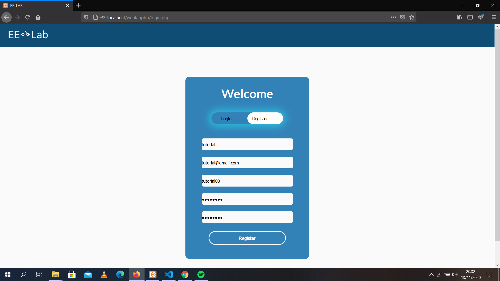

Jika proses berhasil, user akan diberitahu bahwa register telah berhasil dan data user akan masuk kedalam database.
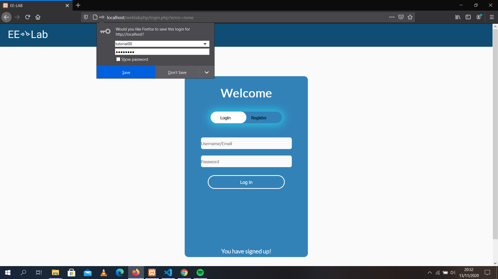

Proses akan gagal jika terdapat kesalahan saat melakukan register.
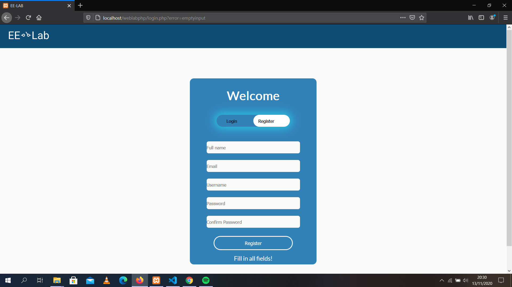

### Login 
Login dengan username dan password yang telah dibuat saat melakukan register.
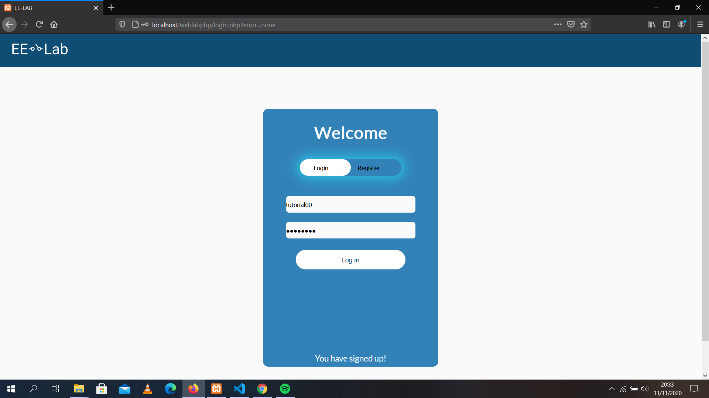

Jika berhasil user akan menuju home page website.
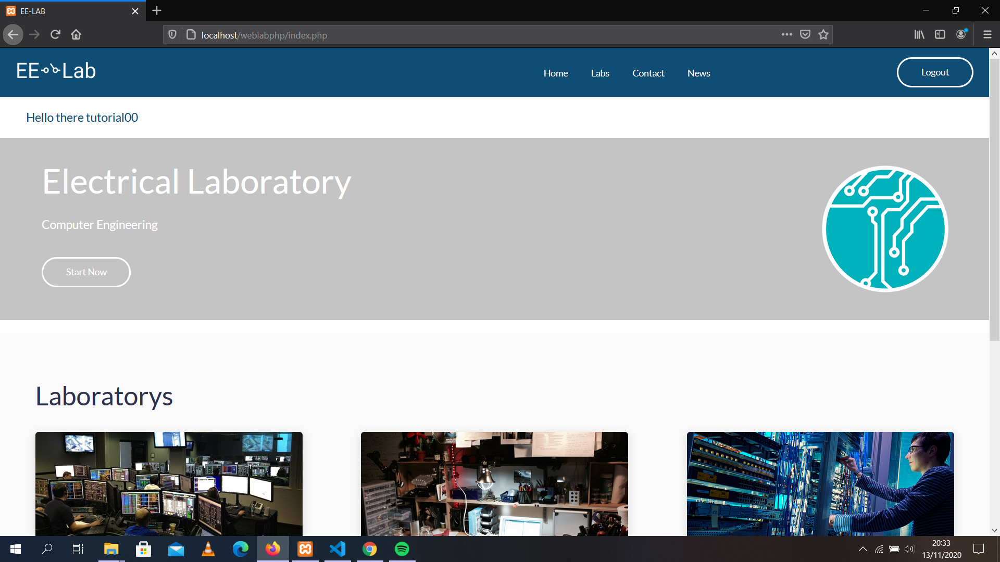

Proses akan gagal jika terdapat kesalahan saat melakukan login.
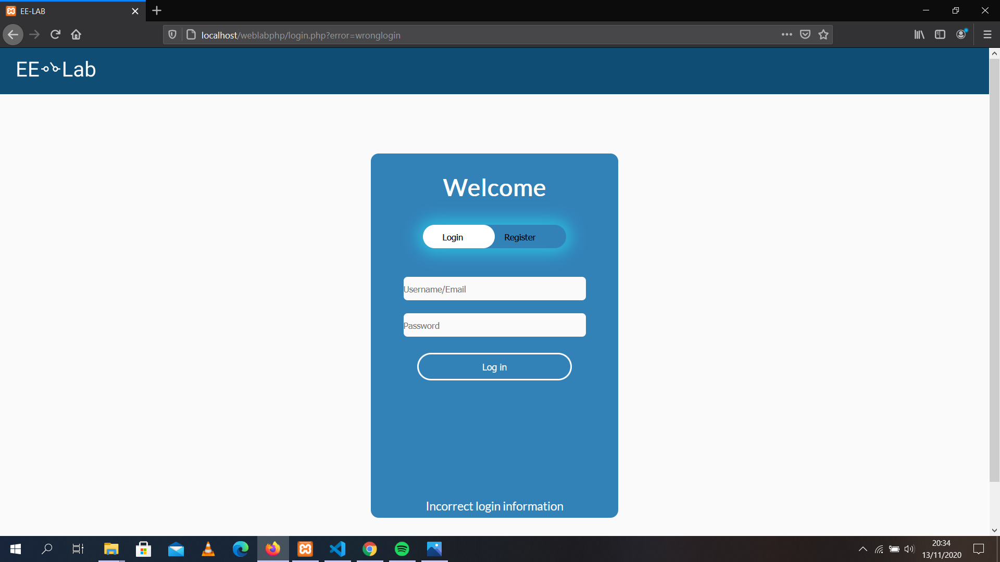

## B. Menggunakan Website
Setelah login berhasil, website akan menuju ke home page, dimana terdapat beberapa hal yang terdapat pada website.

### Praktikum Online
Praktikum online adalah kegunaan utama dari website. Praktiukum online dimulai dengan membuka halaman Labs, diperlukan untuk menekan link "Labs" pada header ataupun menekan tombol "Start Now".

Pada halaman Labs, terdapat tiga laboratorium. Tiga kotak yang menjalaskan laboratorium ini bekerja sebagai link yang menuju kedalam halaman Class dari laboratorium yang berhubungan.
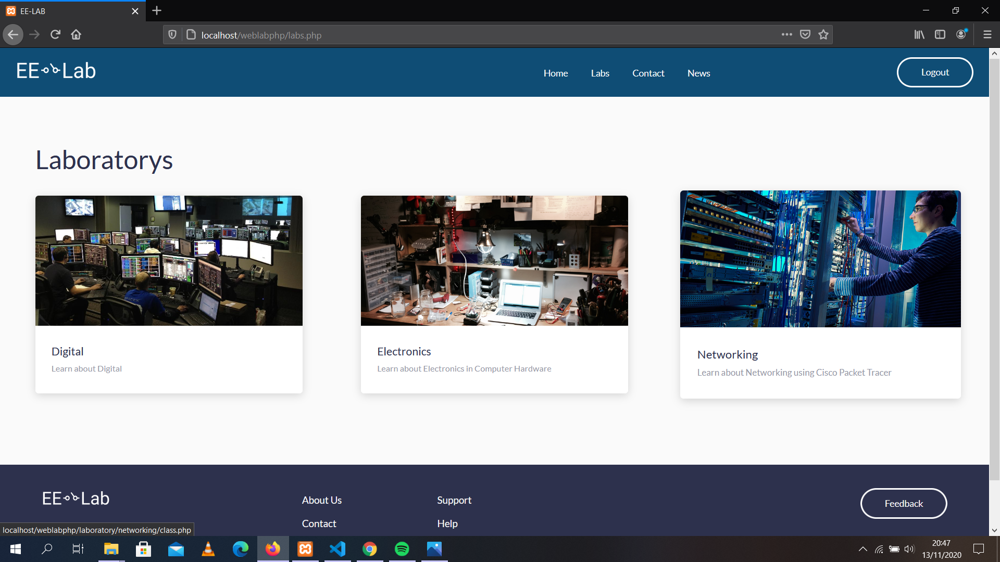

Pada halaman Class, terdapat kelas-kelas dari laboratorium yang dipilih. Pilihlah salah satu kelas untuk menuju halaman Module dari kelas yang berhubungan
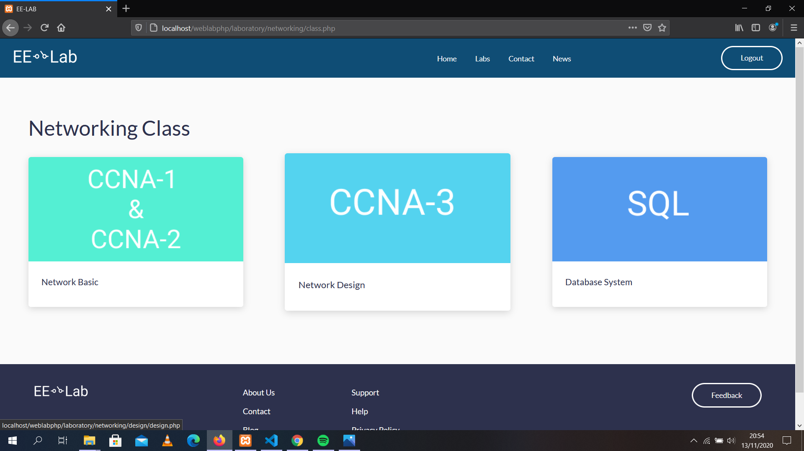

Pada halaman Module, terdapat beberapa chapter dari kelas. Jika salah satu module ditekan, praktikum online dapat dimulai.
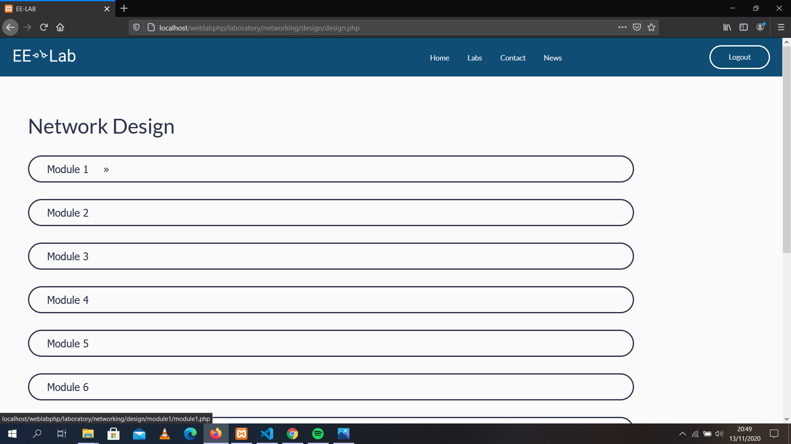

Pada halaman ini, User dapat membuka dasar teori dan case study dari chapter yang berhubungan.
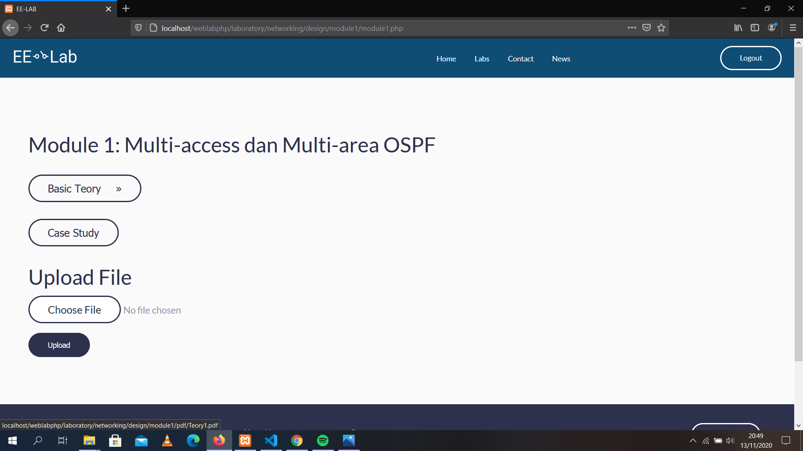

User juga dapat mengupload pengerjaan case study yang telah user buat. Untuk mengupload, diperlukan untuk menekan button "Choose File". 
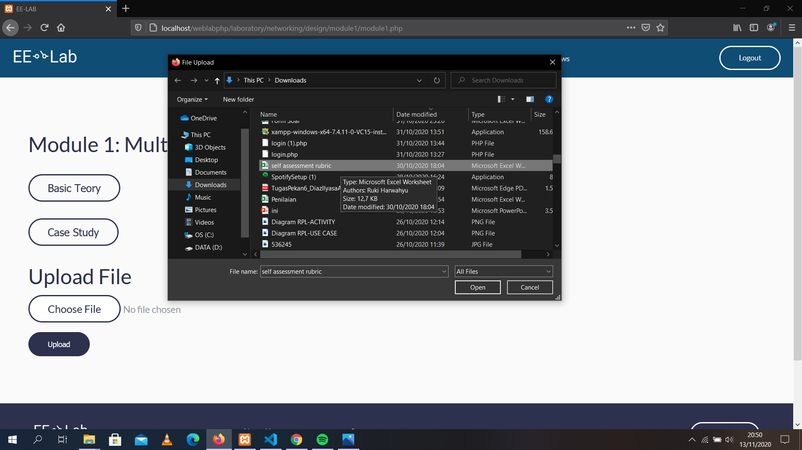

Setelah file dipilih, diperlukan untuk menekan button "Upload" untuk mengupload file yang telah dipilih.
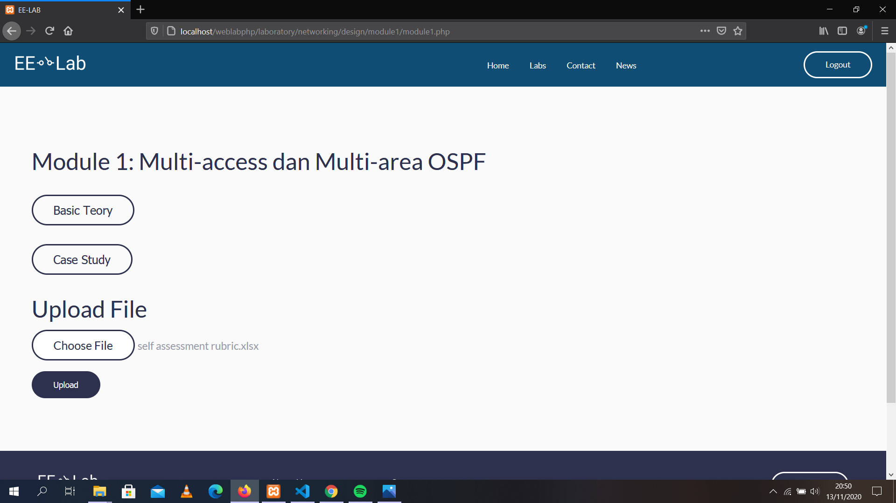

### Feedback
User dapat mengirim feedback kepada pengembang website yang dapat dilakukan dengan menekan button "Feedback". Button ini tersedia di footer pada semua halaman, kecuali halaman Login dan Register.
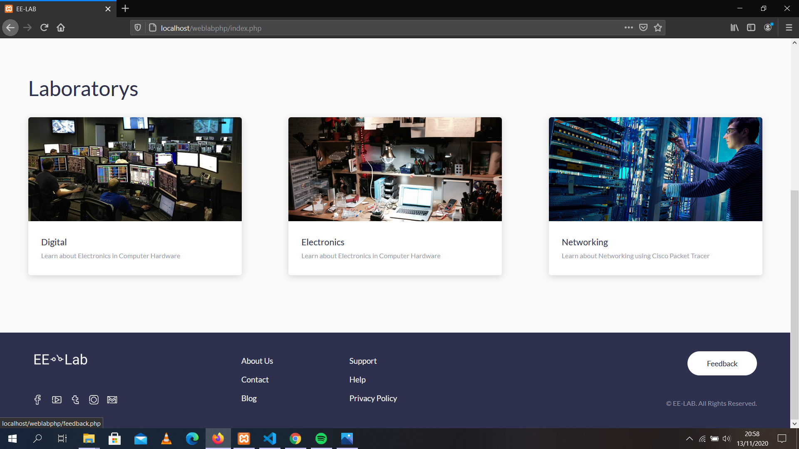

User diperlukan mengisi setiap text box untuk dapat mengirim feedback. 
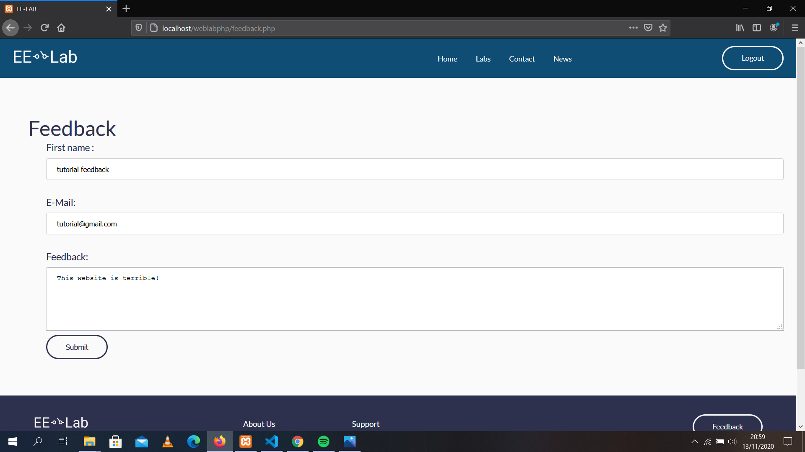

Jika berhasil, user akan menuju halaman yang menyatakan bahwa feedback berhasil dikirim.
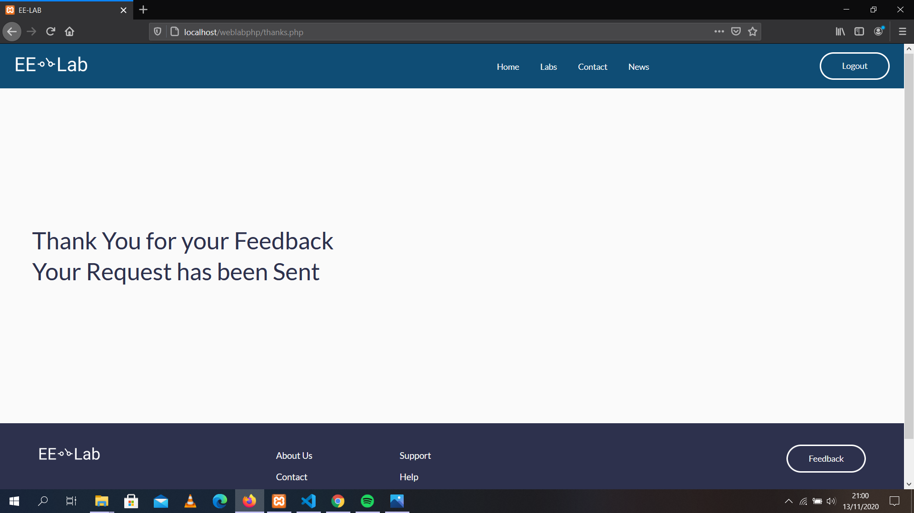

Jika tidak berhasil dikarenakan error pada saat mengirim, user akan menuju halaman yang menyatakan bahwa pegiriman feedback error.
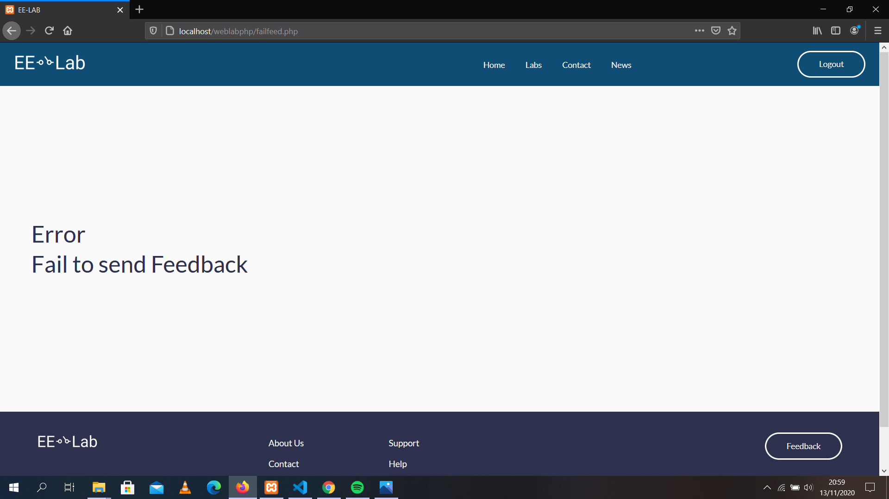

### Contact Us
Halaman Contact Us digunakan untuk menampilkan semua pengembang web dan alamat emailnya.
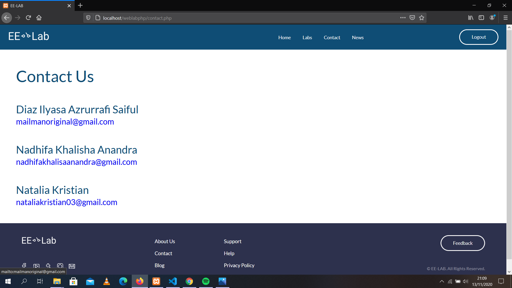

### Lainnya
Halaman lainnya yang terdapat pada header dan footer, seperti News, About, Privacy Policy, dan lain sebagainya belum dapat diselesaikan, sehingga halaman ini diganti dengan halaman Construction yang berada pada notfound.php.
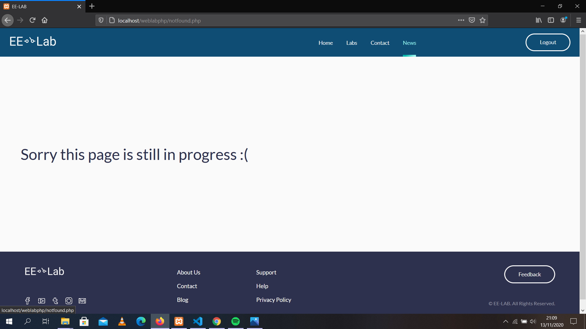

# Catatan
*Catatan penting: Kelas yang tersedia untuk melihat teori, case study, dan mengupload file hanya terdapat pada 
Networking → Network Design → Module1.*
