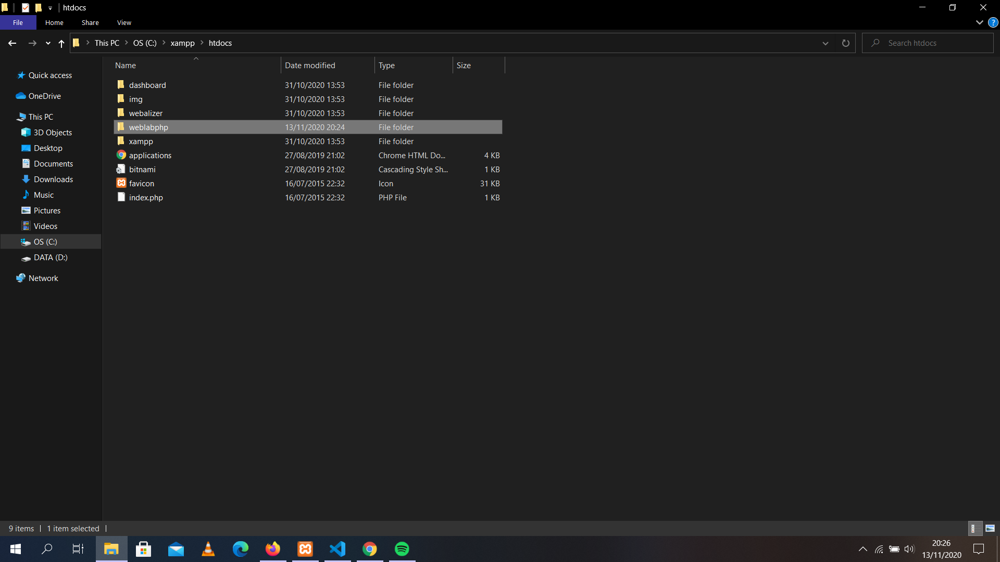
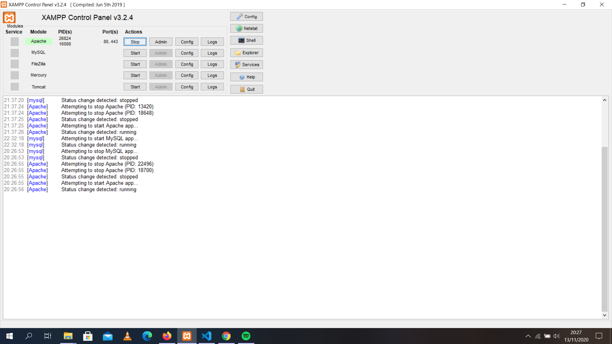
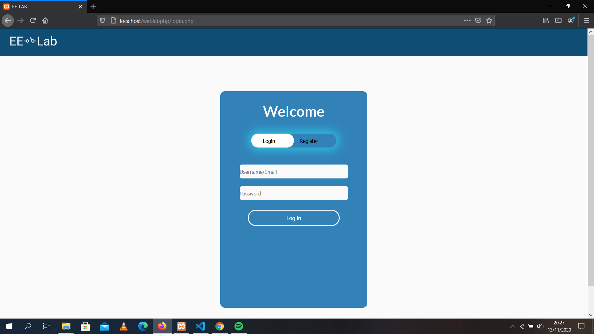
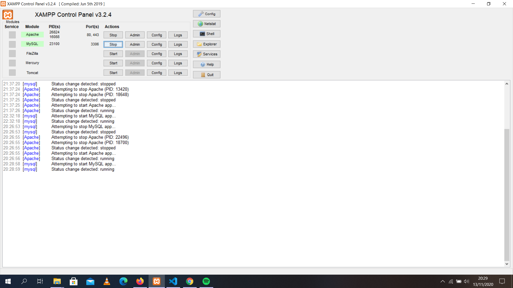
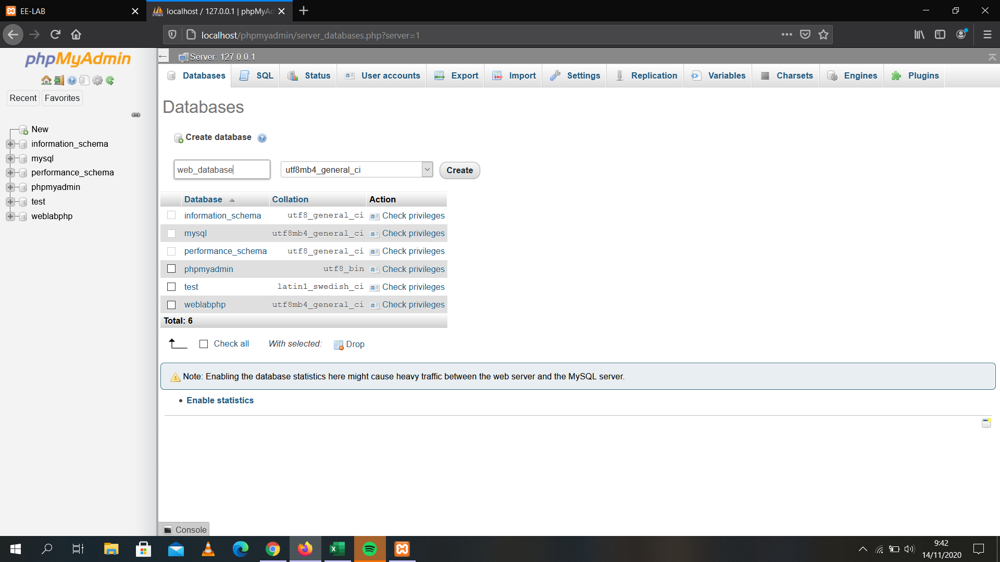
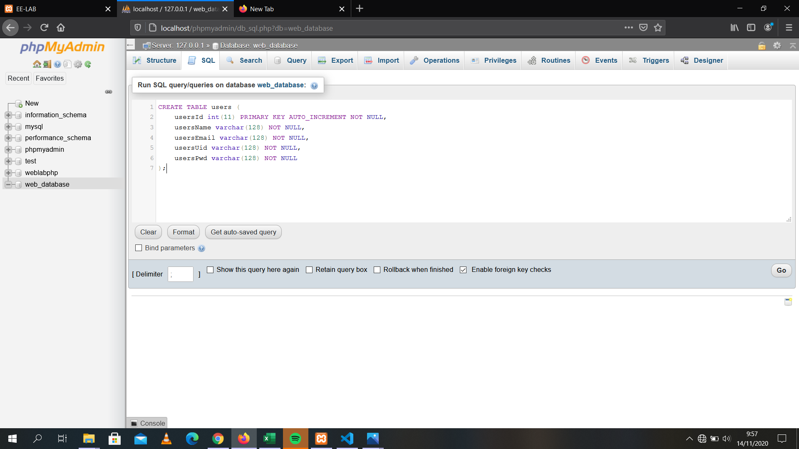

## Anggota
* Diaz Ilyasa Azrurrafi Saiful (1806200154) 
mailmanoriginal@gmail.com
* Nadhifa Khalisha (1806148800)
nadhifakhalisaanandra@gmail.com
* Natalia Kristian (1806201003)
nataliakristian03@gmail.com

# Website E-laboratory
Website E-Laboratory adalah praktikum online yang sudah diintegrasikan pada satu website.
Website ini dapat memudahkan mahasiswa dalam melakukan praktikum online.

# Menjalankan Website
## Online
Website ini belum memiliki domain, sehingga hanya dapat dijalankan dengan menggunakan local server.

## Offline
Untuk menjalankan website, dibutuhkan software seperti XAMPP yang dapat menjalankan file php pada local server.

### A. Menjalankan Website pada Local Server
1. Download dan Install [XAMPP](https://www.apachefriends.org/index.html).
2. Masukkan folder yang memiliki seluruh file website, yaitu "WEBLABPHP", kedalam folder "htdocs" yang berada pada path C:\xampp\htdocs.

3. Menjalan software XAMPP Control Panel dan memulia Apache.

4. Membuka http://localhost/weblabphp/ pada browser.


### B. Database
Untuk menjalaskan website, harus digunakan database untuk dapat melakukan login dan register. Terdapat dua database yang dapat digunakan, yaitu Database yang disediakan oleh dev website dan database local server.
#### Online Database
Command pemanggil server pada file dbh.inc.php pada path C:\xampp\htdocs\weblabphp\include secara default memanggil server database online.
```php
$severName = "weblabphp.cvi3aj31gxm7.us-east-1.rds.amazonaws.com";
$dBUserName = "eelab";
$dBPassword = "beatsme85";
$dBName = "web";
```
Hubungi pengembang website untuk menghidupkan database.

#### Local Server Database
Untuk menjalankan database pada local server, ikuti langkah berikut:
1. Menyalakan MySQL pada XAMPP

2. Membuka http://localhost/phpmyadmin/ pada bowser
//image
3. Pada PHPMyAdmin, click "New" untuk menambah database, dan berikan nama "web_database" (click "Create" untuk membuat database tersebut).

4. Click SQL yang berada pada header PHPMyAdmin dan masukkan command sebagai berikut (click "Go" setelah mengisi command untuk membuat table tersebut).
```sql
CREATE TABLE users (
	usersId int(11) PRIMARY KEY AUTO_INCREMENT NOT NULL,
    usersName varchar(128) NOT NULL,
    usersEmail varchar(128) NOT NULL,
    usersUid varchar(128) NOT NULL,
    usersPwd varchar(128) NOT NULL
);
```


5. Mengganti command pemanggil server pada file dbh.inc.php pada path C:\xampp\htdocs\weblabphp\include untuk memanggil database local server menjadi:
```php
$severName = "localhost";     
$dBUserName = "root";        
$dBPassword = "";         
$dBName = "web_database"; 
```

6. Lakukan Register dan Login, lalu website sudah dapat digunakan.

### Catatan
*Catatan penting: Kelas yang tersedia untuk melihat teori, case study, dan mengupload file hanya terdapat pada 
Networking → Network Design → Module1.*
### Catatan
*Catatan penting: Baca [a relative link](Navigaton.md) untuk mengetauhi setiap halaman website.*
